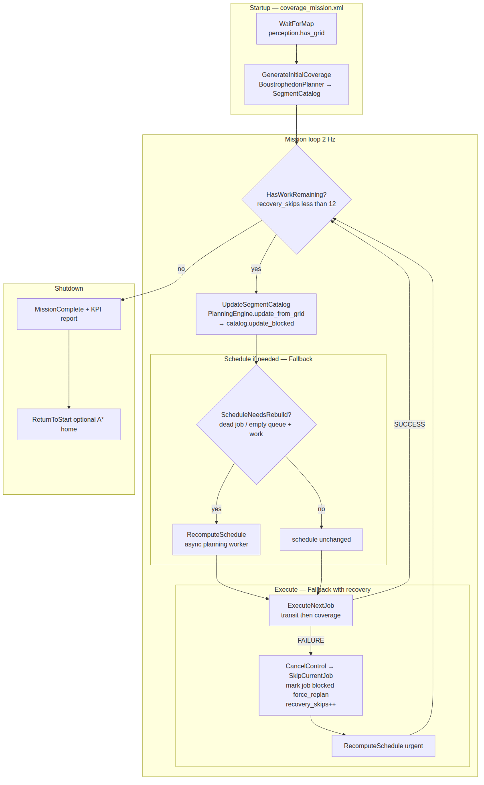
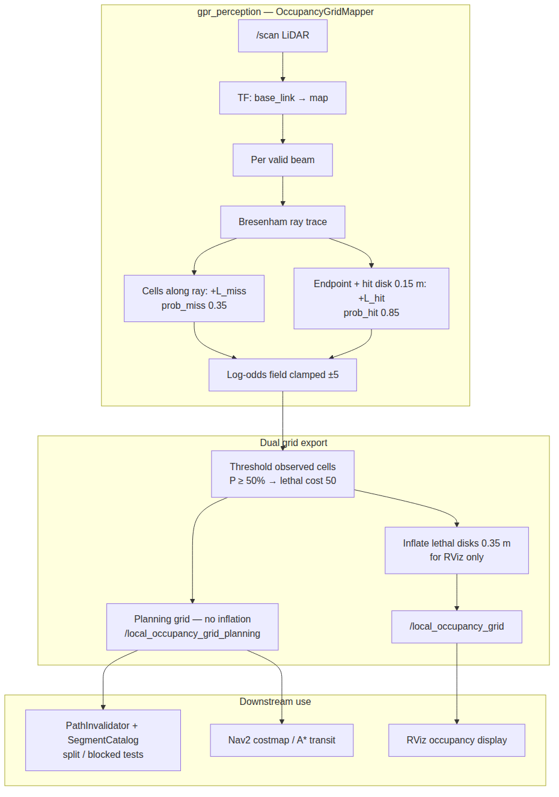
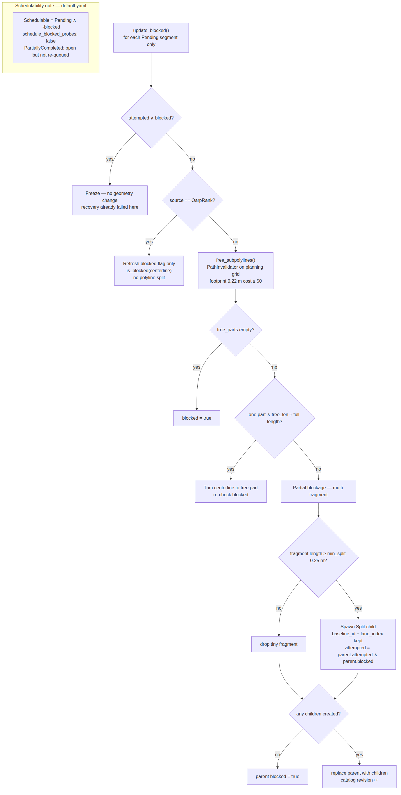
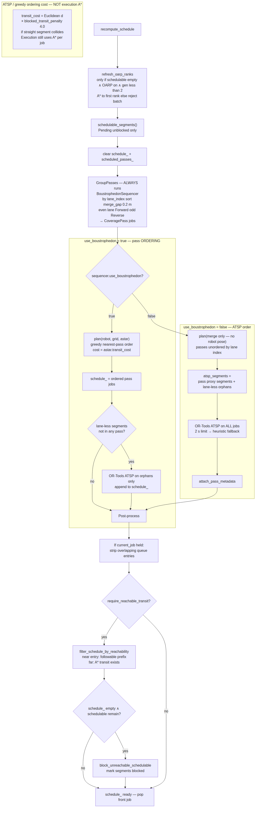
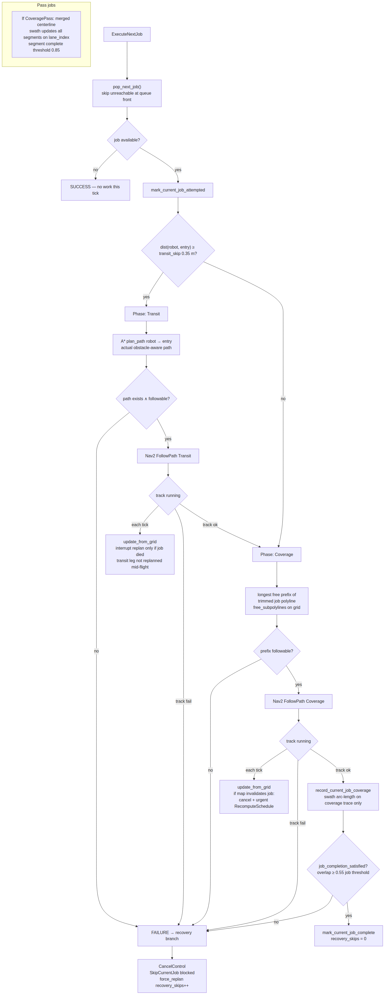

# Adaptive GPR Coverage — Algorithms

Pseudocode aligned with `gpr_bringup/config/gpr_coverage.yaml`.  
See also: [SEQUENCING_AND_SEGMENTS.md](SEQUENCING_AND_SEGMENTS.md) · [TECHNICAL_REFERENCE.md](TECHNICAL_REFERENCE.md)

Flowcharts are PNGs under `images/algorithms/` (regenerate: `python3 docs/generate_diagram_pdfs.py --embed-algorithms`).

---

## 1. System overview

**Pipeline roles**

| Stage | Module | Output |
|-------|--------|--------|
| Plan | `BoustrophedonPlanner` | Master segments + viz path |
| Map | `OccupancyGridMapper` | Planning + viz grids |
| Invalidate | `PathInvalidator` + `SegmentCatalog` | Split / blocked segments |
| Group | `BoustrophedonSequencer` | Lane **passes** (always, both modes) |
| Order | Boustrophedon pass order (default) **or** ATSP (`use_boustrophedon: false`) | Job **queue** |
| Connect | `AStarGridPlanner` | Transit polylines (execution) |
| Cover | Swath coverage + Nav2 | Segment outcomes |

---

## 2. Parameters

| Symbol | Config key | Value |
|--------|------------|-------|
| `INSET` | `coverage_inset` | 0.60 m |
| `LANE_SPACING` | `lane_spacing` | 0.5 m |
| `SEGMENT_LENGTH` | `segment_length` | 1.0 m |
| `MERGE_GAP` | `sequencer.merge_gap_m` | 0.2 m |
| `MIN_SPLIT_LEN` | `segment_catalog.min_split_length_m` | 0.25 m |
| `FOOTPRINT` | `path_invalidator.footprint_radius` | 0.22 m |
| `TRANSIT_SKIP` | `control.transit_skip_distance` | 0.35 m |
| `BLOCKED_PENALTY` | `astar.blocked_transit_penalty` | 4.0 |
| `COMPLETE_FRAC` | `coverage.min_complete_fraction` | 0.85 |
| `PARTIAL_FRAC` | `coverage.min_partial_fraction` | 0.35 |
| `MAX_RECOVERY_SKIPS` | *(code)* | 12 |
| `OARP_MAX_GEN` | `oarp_lite.max_replan_generations` | 2 |
| `USE_BOUST_ORDER` | `sequencer.use_boustrophedon` | **true** |

---

## 3. Algorithm 1 — Mission control

| | |
|---|---|
| **Requires** | `perception.has_grid()` |
| **Ensures** | Coverage report exported; optional return home |
| **Retries** | ≤ 12 consecutive job failures, then stop |

| Step | Statement |
|:----:|-----------|
| 1 | **WaitForMap** — block until planning grid exists |
| 2 | **GenerateInitialCoverage** — Alg. 2 |
| 3 | `recovery_skips ← 0` |
| 4 | **while** `HasWorkRemaining()` **and** `recovery_skips < 12` **do** |
| 4.1 | &emsp;**UpdateSegmentCatalog** — Alg. 4 |
| 4.2 | &emsp;**if** `ScheduleNeedsRebuild()` **or** `force_replan` **then** **RecomputeSchedule** — Alg. 6 |
| 4.3 | &emsp;`result ←` **ExecuteNextJob** — Alg. 8 |
| 4.4 | &emsp;**if** `result = FAILURE` **then** cancel Nav2; mark job blocked; `force_replan ← true`; `recovery_skips++` |
| 4.5 | &emsp;**else if** `result = SUCCESS` **then** `recovery_skips ← 0` |
| 5 | **MissionComplete** — export KPI report |
| 6 | **if** return-home enabled **then** Nav2 follow `A*(robot, home)` |

---

## 4. Algorithm 2 — GenerateInitialCoverage

| | |
|---|---|
| **Ensures** | `catalog` initialized; baseline frozen; `/initial_coverage_path` published |

| Step | Statement |
|:----:|-----------|
| 1 | `region_in ← Inset(SCAN_REGION, INSET)` |
| 2 | `lanes ← ComputeLanes(region_in)` — parallel chords, zig-zag direction per lane index |
| 3 | **for each** `lane ∈ lanes` **do** |
| 3.1 | &emsp;`n ← max(1, ⌈length(lane) / SEGMENT_LENGTH⌉)` |
| 3.2 | &emsp;**for** `s = 0 … n−1` **do** create `CoverageSegment` (Pending, `lane_index`, id = `MakeSegmentId(lane, s)`) |
| 4 | `catalog.Initialize(segments)`; `baseline ← Freeze(segments)` |
| 5 | Publish viz path (lane connectors — **not** catalog jobs) |

---

## 5. Algorithm 3 — Perception update

| Step | Statement |
|:----:|-----------|
| 1 | **for each** valid beam **do** transform hit to `map` |
| 2 | Bresenham ray: all cells except endpoint ← `+L_miss` (clamped ±5) |
| 3 | Endpoint ← `+L_hit`; mark disk radius 0.15 m |
| 4 | Export: observed cells → cost 0–100; lethal if P ≥ 50% |
| 5 | Planning grid = threshold only; viz grid = inflated |

---

## 6. Algorithm 4 — UpdateSegmentCatalog / split

| Step | Statement |
|:----:|-----------|
| 1 | `grid ←` planning grid (`/local_occupancy_grid_planning`) via `update_from_grid` |
| 2 | **for each** `outcome = Pending` **do** `apply_split_update` |
| 3 | **if** `attempted ∧ blocked` **then** freeze (recovery failed here) |
| 4 | **else if** `source = OarpRank` **then** refresh `blocked` only — no split |
| 5 | **else** `free_subpolylines` → full free: trim; partial: Split children ≥ `MIN_SPLIT_LEN`; none/tiny: `blocked` |
| 6 | Schedulable = Pending ∧ ¬blocked (`schedule_blocked_probes: false`); PartiallyCompleted stays open but not re-queued |

**IsBlocked(centerline, grid):** sample every ≤ 0.05 m; disk collision with `FOOTPRINT` and cost ≥ 50.

---

## 7. Algorithm 5 — GroupPasses (boustrophedon sequencer)

*Always runs before ordering. Does **not** choose global job order unless `USE_BOUST_ORDER = true`.*

| Step | Statement |
|:----:|-----------|
| 1 | Group schedulable segments by `lane_index` |
| 2 | Lane direction: `lane_index mod 2 = 0` → Forward, else Reverse |
| 3 | Sort within lane by scan-line coordinate |
| 4 | Merge consecutive segments if any endpoint pair within `MERGE_GAP` |
| 5 | **FlushRun** → `CoveragePass` (merged centerline, `segment_ids`, synthetic `PASS` job id) |

---

## 8. Algorithm 6 — RecomputeSchedule

| Step | Statement |
|:----:|-----------|
| 1 | **refresh_oarp_ranks** — Alg. 11 (only when schedulable empty) |
| 2 | `schedulable ←` Pending, unblocked segments |
| 3 | `passes ← GroupPasses` — Alg. 5 (**always**, both modes) |
| 4a | **`USE_BOUST_ORDER = true`:** greedy nearest-pass order (`plan` with robot+grid); ATSP on lane-less orphans only |
| 4b | **`USE_BOUST_ORDER = false`:** merge-only passes; **SolveATSP** on pass proxies + orphans — Alg. 7 |
| 5 | Strip queue jobs overlapping held `current_job` |
| 6 | **filter_schedule_by_reachability** — near entry: followable prefix; far: A* transit exists |
| 7 | **if** queue empty but schedulable remain **then** `block_unreachable_schedulable` |

---

## 9. Algorithm 7 — SolveATSP (default ordering)

| | |
|---|---|
| **Cost metric** | Penalized Euclidean straight-line on grid — **not** A* |
| **Solver** | OR-Tools, 2 s; one attempt → heuristic fallback |
| **Next job** | Front of queue after filter — not re-solved each tick |

**TransitCost(from, to, grid)**

| Case | Cost |
|------|------|
| Straight segment free | `d = ‖to − from‖` |
| Straight segment blocked | `d × BLOCKED_PENALTY` |

| Step | Statement |
|:----:|-----------|
| 1 | Build directed jobs: Forward + Reverse per segment (unless pass fixed direction) |
| 2 | Build cost matrix: depot → jobs → optional home |
| 3 | OR-Tools ATSP with disjunction (≤ one direction per physical segment) |
| 4 | **if** solve fails **then** greedy nearest-neighbor |
| 5 | Return ordered `CoverageJob` list |

**Execution** uses **A\*** once per job for actual transit — see Alg. 8.

---

## 10. Algorithm 8 — ExecuteNextJob

| Phase | Condition | Action |
|-------|-----------|--------|
| **Dequeue** | | `job ← PopNextJob()` — front of queue |
| **Transit** | `dist(robot, entry) ≥ TRANSIT_SKIP` | `A*(robot, entry)` → Nav2 FollowPath; trace phase = Transit |
| **Coverage** | always after transit (or skip) | longest free prefix of trimmed job polyline → Nav2; trace phase = Coverage |
| **Record** | Nav2 success | **RecordSwathCoverage** — Alg. 9 |
| **Complete** | `job_completion_satisfied` (overlap ≥ 0.55) | mark complete; reset `recovery_skips`; **else** FAILURE → recovery |
| **Recovery** | FAILURE | `CancelControl` → `SkipCurrentJob` (blocked) → urgent replan; `recovery_skips++` |

**Interrupt replan:** coverage phase — map invalidates followable prefix → cancel + urgent replan. Transit phase — replan only if the job itself died (not mid-A* reroute).

---

## 11. Algorithm 9 — Swath coverage

| Step | Statement |
|:----:|-----------|
| 1 | Use **coverage-only** executed trace (not transit poses) |
| 2 | **for each** trace pose: project onto centerline; accept if lateral ≤ 0.22 m and heading ≤ 35° (bidirectional) |
| 3 | Accumulate arc intervals; `frac = covered_length / total_length` |
| 4 | **if** pass job **then** update segments in `job.covers` only (split children via `baseline_id`) |
| 5 | Outcome: `frac ≥ 0.85` → Completed; `≥ 0.35` → Partial; any progress → Partial (not re-queued); else Pending |

---

## 12. Algorithm 10 — Reachability & replan triggers

**IsJobReachable(job, robot)**

| Condition | Reachable when |
|-----------|----------------|
| Near entry (`d < TRANSIT_SKIP`) | coverage prefix followable on grid |
| Far | `A*(robot, entry)` exists and path traversable |

**ScheduleNeedsRebuild** ← true when: current or queued job dead; queue empty with schedulable work; OARP idle retry pending.

**HasWorkRemaining** ← true when: queue or current job; or schedulable segments (and not reachability exhausted); or OARP may still inject.

---

## 13. Algorithm 11 — OARP rank injection

| Guard | Action |
|-------|--------|
| OARP disabled / schedulable work exists / gen ≥ 2 | return |
| Else generate free lane ranks ≥ 0.35 m | |
| `A*(robot, first_rank_entry)` fails | reject **entire** batch |
| Else | append `OarpRank` segments; `oarp_generation++` |

---

## 14. Spatial connectivity

| Link | Mechanism |
|------|-----------|
| Fragments on same lane | **GroupPasses** if endpoints within 0.2 m |
| Job *k* → job *k+1* | `A*` transit: `exit(k)` → `entry(k+1)` |
| Initial zig-zag connectors | RViz only — not catalog |

---

## 15. Related documents

| Need | Document |
|------|----------|
| Sequencing Q&A | [SEQUENCING_AND_SEGMENTS.md](SEQUENCING_AND_SEGMENTS.md) |
| Equations + RViz | [TECHNICAL_REFERENCE.md](TECHNICAL_REFERENCE.md) |
| PDF build | [README.md](README.md) |
